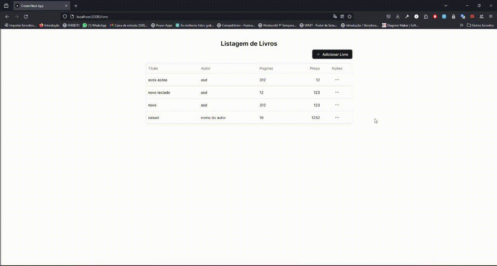

## Crud NEXTJS

Primeiro, execute o servidor de desenvolvimento:

```bash
npm run dev
# ou
yarn dev
# ou
pnpm dev
# ou
bun dev

- Definir as variáveis de ambiente no arquivo .env
    - DB_USER
    - DB_PASSWORD
    - DB_NAME
```

Abra [http://localhost:3000/livro](http://localhost:3000/livro) com seu navegador para ver o resultado.

## Biblioteca usadas e Tecnologias

- TailwindCSS
- [Shadcn UI](https://ui.shadcn.com/)
- [Radix UI](https://www.radix-ui.com/)
- dotenv
- mongoose
- Banco de dados MongoDB

## Funcionalidades

```
- Podemos cadastrar um novo livro, visualizar, editar e excluir.
- Tanto na exclusão quanto na adição e edição do registro, é atualizado em tempo real a listagem.
- UI/UX moderno centralizando todas as operações em uma tela. 
```
## Demonstração a aplicação

